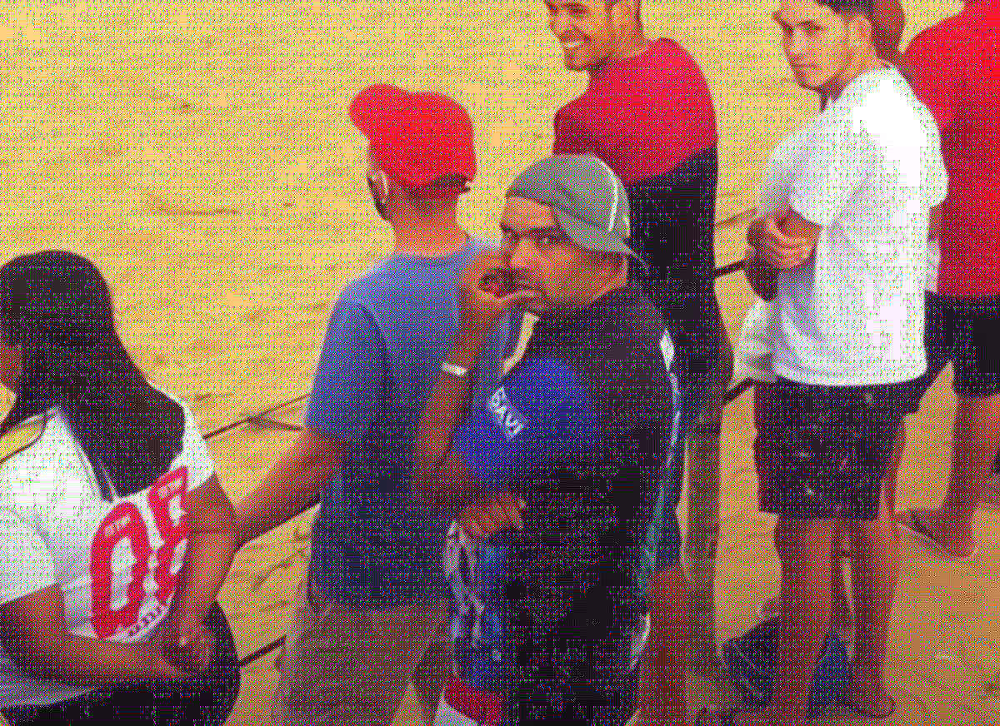

# Documentação de Problemas e Soluções

Este arquivo documenta dois dos problemas mais incomuns encontrados durante o desenvolvimento deste projeto de compressão JPEG. Eles envolvem aberrações cromáticas geradas em diferentes etapas do processo, suas causas, e como foram resolvidos. Abaixo, você encontrará descrições detalhadas e imagens exemplificando cada caso.

---

## Problema 1: Aberrações Cromáticas Pós-Subamostragem

Durante o processo de subamostragem e posterior reconstrução dos canais de crominância, alguns **pontos ou linhas desconexos** surgiam na imagem ao retornar para o espaço de cor RGB. Esses artefatos de cor eram particularmente evidentes em áreas de alta saturação (como vermelho ou azul). 

Veja os exemplos abaixo, onde os pontos problemáticos são destacados:

**Imagem com pontos desconexos:**


**Canal convertido para grayscale, evidenciando os pontos:**


Após investigar várias possíveis causas, incluindo erros nas fórmulas de conversão de YCrCb para RGB e inconsistências no algoritmo de reconstrução dos canais, a solução veio de uma sugestão do professor. Ele apontou que poderia ser um problema de **overflow** nos valores de cor durante a reconstrução. 

Esse overflow fazia com que valores superiores a 255 (como 257 ou 261) ou inferiores a 0 se transformassem em 0 ao serem convertidos para inteiros de 8 bits, gerando as aberrações cromáticas.

A solução foi adicionar duas linhas de código para limitar os valores ao intervalo permitido na função de converção de YCrCb para RGB:

```python
# Corrige erros na escala de cor causados pela reconstrução dos canais de crominância no sub-sampling
result[result > 255] = 255
result[result < 0] = 0
```

---

## Problema 2: Aberrações Cromáticas nas Bordas dos Blocos

---

## Descrição do Problema

Ao aplicar as **transformadas discretas do cosseno (DCT)** em blocos de 8x8 pixels e, em seguida, reconstruir a imagem, **aberrações cromáticas** surgiam nas bordas dos blocos, especialmente no canto superior esquerdo. 

Essas aberrações geravam um efeito visual desagradável, contaminando áreas maiores da imagem:

1. **Imagens menores:** Aberrações mais perceptíveis, quase comprometendo a visualização.
2. **Imagens maiores:** Criavam um aspecto de "granulado" em regiões específicas, como mostrado abaixo:

**Artefatos nas bordas dos blocos:**



**Granulação perceptível em imagens menores:**


---

## Tentativas de Solução

Inicialmente, tentei aplicar diferentes filtros para atenuar o problema, como:

- **Filtro bilinear**
- **Filtro de média**
- Outros filtros disponíveis em bibliotecas populares

Embora esses filtros ajudassem a disfarçar o problema em imagens grandes, eles pioravam o aspecto visual em imagens menores. Além disso, essas soluções não atacavam a causa raiz do problema.

Após pesquisar mais profundamente, descobri que o problema estava relacionado ao **arredondamento incorreto** na etapa de quantização dos coeficientes da DCT.

---

## Diagnóstico e Solução

Durante a quantização, utilizava a função `np.ceil` para o arredondamento, conforme algumas referências que consultei. Contudo, isso amplificava o problema. Testei outros métodos:

- **`np.floor`:** Não corrigiu o problema.
- **`np.round`:** Solução definitiva. 

Ao substituir por `np.round`, as aberrações cromáticas desapareceram completamente. A função de arredondamento correta foi essencial para garantir que os valores quantizados fossem precisos e compatíveis com a reconstrução da imagem.


## Conclusão

Este problema destaca a importância de selecionar cuidadosamente os métodos de arredondamento durante a quantização. A solução eliminou as aberrações cromáticas, garantindo uma reconstrução fiel da imagem.

Caso você encontre problemas semelhantes ao trabalhar com transformadas discretas ou quantização, considere verificar o arredondamento usado no processo.

---

